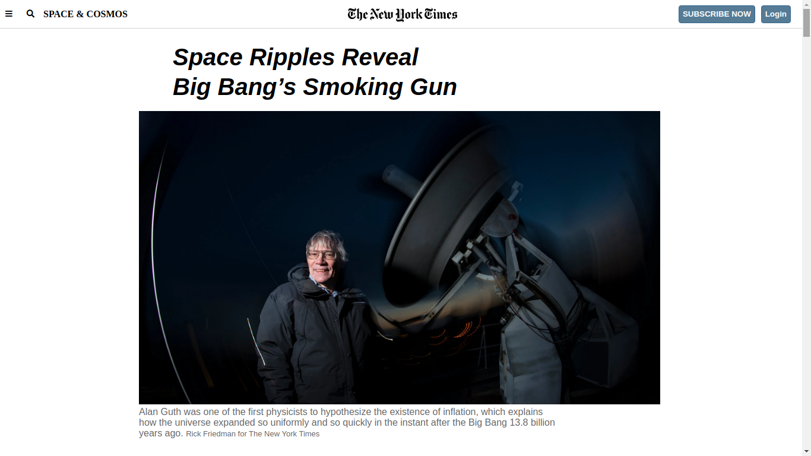

# Project-3: POSITIONING-AND-FLOATING-ELEMENTS  - NewyorkTime's article page clone

> This project consists of building an HTML document that matches the appearance of NewyorkTime's article page.

Use of Grid and Flex in Designing. Postioning and floating of elements to make this site.

## Built With

- HTML, CSS
- Grid system layout

## Live Demo

[Live Demo Link](https://rawcdn.githack.com/hemant-soni-vst-au4/POSITIONING-AND-FLOATING-ELEMENTS/27ca2882ab7714b584ccf9ceffb28536c2d9a17c/index.html)

## Authors

👤 **Hemant soni**

- Github: [@githubhandle](https://github.com/hemant-soni-vst-au4)
- Twitter: [@twitterhandle](https://twitter.com/abdelperez11)
- Linkedin: [linkedin](https://www.linkedin.com/in/hemant-soni-97427b193/)

## 🤝 Contributing

Contributions, issues and feature requests are welcome!

Feel free to check the [issues page](https://github.com/hemant-soni-vst-au4/POSITIONING-AND-FLOATING-ELEMENTS/issues).

## Show your support

Give a ⭐️ if you like this project!

